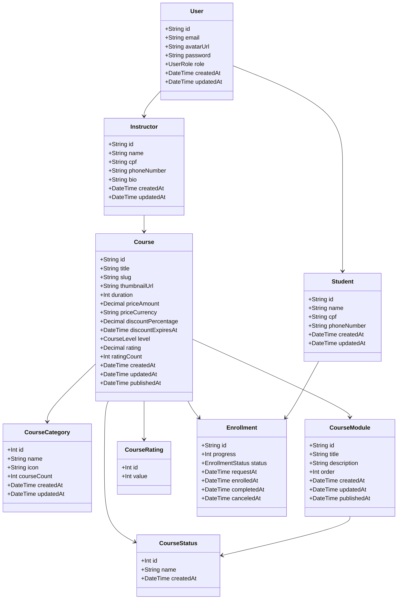
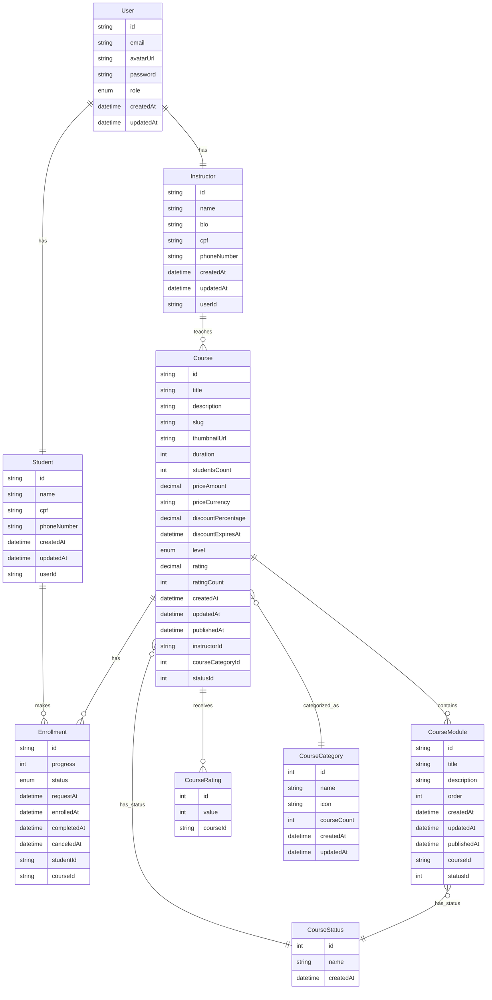

# 🧩 Plataforma de E-learning

Este projeto consiste na implementação de uma plataforma de e-learning, projetada com foco em modularidade, escalabilidade, testabilidade e manutenibilidade[cite: 3]. O desenvolvimento utiliza NestJS com TypeScript, seguindo os princípios do Domain-Driven Design (DDD)[cite: 9, 11].

---
## 🚀 Tecnologias Utilizadas

### 🔙 Back-end

* ⚙️ **Linguagem Principal**: TypeScript (com Node.js) [cite: 21, 22]
* 🌱 **Framework**: NestJS [cite: 9, 22]
* 🐘 **Banco de Dados**: MySQL [cite: 22]
* 🗃️ **ORM**: Prisma [cite: 22]
* 🔐 **Autenticação**: JWT (JSON Web Tokens) [cite: 38]
* 📚 **Documentação da API**: Swagger (previsto) [cite: 38]
* 🧪 **Testes**: Vitest, Faker [cite: 22]
* 🐳 **Outros**: Docker [cite: 22]

### 🧾 Versionamento

* 🗂️ **Git & GitHub**: Implícito pelo uso de CI/CD com GitHub Actions [cite: 61]

### 🗂️ Organização e Documentação

* 📖 **Documentação Técnica**: O documento fornecido é um exemplo da documentação técnica do projeto[cite: 19].

---
## 🗂️ Estrutura de Pastas

A estrutura do projeto segue uma arquitetura em camadas e domínios, separando responsabilidades entre core (núcleo de domínio genérico), domínio específico (e-learning), e infraestrutura[cite: 22].

### 📁 Módulos Principais

* 📦 prisma/migrations/: Migrações do banco de dados gerenciadas pelo Prisma[cite: 23].
* 📦 src/api/core/: Núcleo de domínio genérico.
    * either/: Implementação do tipo Either (Right/Left) para retorno funcional[cite: 23].
    * entities/: Entidades genéricas de domínio[cite: 23].
    * value-objects/: Objetos de valor reutilizáveis (ex: Email, CPF)[cite: 24].
    * enums/: Enumerações compartilhadas[cite: 24].
    * errors/errors/: Tipos e classes de erro padrão do domínio[cite: 24].
    * events/: Definições e contratos de eventos do domínio[cite: 24].
    * repositories/: Interfaces genéricas de repositórios[cite: 25].
    * types/: Tipos auxiliares e contratos[cite: 25].
* 📦 src/api/domain/e-learning/: Domínio específico de e-learning.
    * application/: Camada de aplicação do domínio e-learning[cite: 25].
        * repositories/: Contratos de repositórios específicos (ex: ICourseRepository)[cite: 25].
        * subscriber/: Subsistemas que reagem a eventos de domínio[cite: 25].
        * use-cases/: Casos de uso organizados por contexto (course, enrollment, instructor, payment, student)[cite: 26, 27].
    * enterprise/: Camada de domínio empresarial (entidades de negócio)[cite: 27].
        * entities/: Entidades centrais (Course, Enrollment, etc.)[cite: 27].
        * value-objects/: Objetos de valor específicos por contexto (course, enrollment, lesson, payment, price, quiz, slug, user)[cite: 28, 29, 30].
        * events/: Eventos de domínio específicos do e-learning[cite: 30].
* 📦 src/api/infra/: Camada de infraestrutura.
    * database/prisma/: Implementação relacionada ao Prisma ORM.
        * mappers/: Conversores entre entidades do domínio e modelo Prisma[cite: 30].
        * repositories/: Implementações dos repositórios usando Prisma[cite: 30].
    * nodeMailer/: Serviço de envio de emails via NodeMailer[cite: 30].
* 🧪 test/: (Estrutura de testes não detalhada no mesmo nível, mas Vitest é a ferramenta [cite: 22]).

---
## 🚀 Diagrama de Classes

---
## 🚀 Diagrama de Relacionamento

---
## ✅ Roteiro de Testes: Cadastro de Estudante (Funcionalidade F01 [cite: 32])

Este roteiro descreve os testes unitários e de validação aplicados à funcionalidade de **criação de conta para estudante** no sistema[cite: 32].

### 🧪 Objetivo

Garantir que o cadastro de novos estudantes funcione conforme o esperado, validando os dados de entrada e a criação correta do usuário no sistema.

### 📋 Campos do Cadastro de Estudante (baseado em registerStudent [cite: 46])

| Campo         | Obrigatório | Tipo/Validação                      |
|---------------|-------------|-------------------------------------|
| name          | ✅ Sim      | string                              |
| email         | ✅ Sim      | string, formato de e-mail válido    |
| password      | ✅ Sim      | string (espera-se validação de força) |
| cpf           | ✅ Sim      | string, formato de CPF válido       |
| phoneNumber   | ✅ Sim      | string                              |

### ✅ Casos de Teste de Validação (Entidade/DTO) (baseado em registerStudent [cite: 47])

| ID   | Descrição do Teste        | Resultado Esperado                    |
|------|---------------------------|---------------------------------------|
| CT01 | Cadastro com dados válidos | Estudante criado com sucesso          |
| CT02 | E-mail já cadastrado      | Erro: "E-mail já cadastrado"         |
| CT03 | CPF inválido              | Erro: "CPF inválido"                  |
| CT04 | Senha fraca               | Erro: "Senha fraca" (ou similar)      |
| CT05 | Nome vazio                | Erro: Campo obrigatório (ou similar) |
| CT06 | E-mail vazio              | Erro: Campo obrigatório (ou similar) |
| CT07 | Senha vazia               | Erro: Campo obrigatório (ou similar) |
| CT08 | CPF vazio                 | Erro: Campo obrigatório (ou similar) |
| CT09 | Telefone vazio            | Erro: Campo obrigatório (ou similar) |

### 🧪 Casos de Teste Unitário - Controller (Endpoint: POST /accounts/students [cite: 40])

| ID   | Descrição                                       | Resultado Esperado                       |
|------|-------------------------------------------------|------------------------------------------|
| TC01 | Registrar estudante via POST com dados válidos  | HTTP 201 (Created) com dados do estudante |
| TC02 | Registrar estudante com e-mail já existente     | HTTP 4xx (Client Error) com mensagem de erro |
| TC03 | Registrar estudante com CPF inválido            | HTTP 4xx (Client Error) com mensagem de erro |
| TC04 | Registrar estudante com campo obrigatório ausente | HTTP 4xx (Client Error) com mensagem de erro |

### 🧪 Casos de Teste Unitário - Service (Lógica) (baseado em registerStudent use-case [cite: 46])

| ID   | Descrição                                     | Resultado Esperado                            |
|------|-----------------------------------------------|-----------------------------------------------|
| TS01 | Salvar entidade Student no repositório       | Entidade salva corretamente no banco de dados |
| TS02 | Tentar salvar com e-mail duplicado            | Exceção/Erro indicando e-mail duplicado     |
| TS03 | Tentar salvar com CPF inválido (se validado no serviço) | Exceção/Erro indicando CPF inválido          |

### 🧪 Casos de Teste Unitário - Service/Query (Consulta) (Exemplo: getStudent [cite: 49])

| ID   | Descrição                         | Resultado Esperado                               |
|------|-----------------------------------|--------------------------------------------------|
| TQ01 | Buscar estudante por ID existente | Estudante retornado com sucesso com dados básicos [cite: 49] |
| TQ02 | Buscar estudante por ID inexistente | Erro: "Aluno não encontrado" ou nulo/vazio [cite: 49]      |

---
## 🧰 Tecnologias de Teste

* **Framework de Teste**: Vitest [cite: 22, 61]
* **Mocking**: Mocks são usados para serviços externos como E-mail, Pagamento, JWT e Banco de Dados em cenários de teste[cite: 64].
* **Testes de API/Integração**: Supertest (usado com Vitest) [cite: 61]
* **Manipulação de Dados de Teste**: Faker [cite: 22]
* **Banco de Dados para Testes**: Prisma com Docker + seed [cite: 64]

---
## ▶️ Como Executar os Testes

* Testes são executados automaticamente a cada push e pull request via CI/CD (GitHub Actions)[cite: 61].
* (Comandos específicos para execução local como npm test ou similar não detalhados, mas seriam padrão para um projeto Vitest).

---
## ⚙️ Dependências e Build (Principais)

* **Linguagem**: TypeScript [cite: 22]
* **Framework**: NestJS [cite: 22]
* **ORM**: Prisma [cite: 22]
* **Banco de Dados**: MySQL [cite: 22]
* **Conteinerização**: Docker [cite: 22]
* **Testes**: Vitest [cite: 22]

---

<p align="center">
  <a href="http://nestjs.com/" target="blank"></a>
</p>

[circleci-image]: https://img.shields.io/circleci/build/github/nestjs/nest/master?token=abc123def456
[circleci-url]: https://circleci.com/gh/nestjs/nest

  <p align="center">A progressive <a href="http://nodejs.org" target="_blank">Node.js</a> framework for building efficient and scalable server-side applications.</p>
    <p align="center">
<a href="https://www.npmjs.com/~nestjscore" target="_blank"></a>
<a href="https://www.npmjs.com/~nestjscore" target="_blank"></a>
<a href="https://www.npmjs.com/~nestjscore" target="_blank"></a>
<a href="https://circleci.com/gh/nestjs/nest" target="_blank"></a>
<a href="https://discord.gg/G7Qnnhy" target="_blank"></a>
<a href="https://opencollective.com/nest#backer" target="_blank"></a>
<a href="https://opencollective.com/nest#sponsor" target="_blank"></a>
  <a href="https://paypal.me/kamilmysliwiec" target="_blank"></a>
    <a href="https://opencollective.com/nest#sponsor"  target="_blank"></a>
  <a href="https://twitter.com/nestframework" target="_blank"></a>
</p>
  <!--[](https://opencollective.com/nest#backer)
  [](https://opencollective.com/nest#sponsor)-->

## Description

[Nest](https://github.com/nestjs/nest) framework TypeScript starter repository.

## Project setup

```bash
$ npm install
```

## Compile and run the project

```bash
# development
$ npm run start

# watch mode
$ npm run start:dev

# production mode
$ npm run start:prod
```

## Run tests

```bash
# unit tests
$ npm run test

# e2e tests
$ npm run test:e2e

# test coverage
$ npm run test:cov
```

## Deployment

When you're ready to deploy your NestJS application to production, there are some key steps you can take to ensure it runs as efficiently as possible. Check out the [deployment documentation](https://docs.nestjs.com/deployment) for more information.

If you are looking for a cloud-based platform to deploy your NestJS application, check out [Mau](https://mau.nestjs.com), our official platform for deploying NestJS applications on AWS. Mau makes deployment straightforward and fast, requiring just a few simple steps:

```bash
$ npm install -g mau
$ mau deploy
```

With Mau, you can deploy your application in just a few clicks, allowing you to focus on building features rather than managing infrastructure.

## Resources

Check out a few resources that may come in handy when working with NestJS:

- Visit the [NestJS Documentation](https://docs.nestjs.com) to learn more about the framework.
- For questions and support, please visit our [Discord channel](https://discord.gg/G7Qnnhy).
- To dive deeper and get more hands-on experience, check out our official video [courses](https://courses.nestjs.com/).
- Deploy your application to AWS with the help of [NestJS Mau](https://mau.nestjs.com) in just a few clicks.
- Visualize your application graph and interact with the NestJS application in real-time using [NestJS Devtools](https://devtools.nestjs.com).
- Need help with your project (part-time to full-time)? Check out our official [enterprise support](https://enterprise.nestjs.com).
- To stay in the loop and get updates, follow us on [X](https://x.com/nestframework) and [LinkedIn](https://linkedin.com/company/nestjs).
- Looking for a job, or have a job to offer? Check out our official [Jobs board](https://jobs.nestjs.com).

## Support

Nest is an MIT-licensed open source project. It can grow thanks to the sponsors and support by the amazing backers. If you'd like to join them, please [read more here](https://docs.nestjs.com/support).

## Stay in touch

- Author - [Kamil Myśliwiec](https://twitter.com/kammysliwiec)
- Website - [https://nestjs.com](https://nestjs.com/)
- Twitter - [@nestframework](https://twitter.com/nestframework)

## License

Nest is [MIT licensed](https://github.com/nestjs/nest/blob/master/LICENSE).
